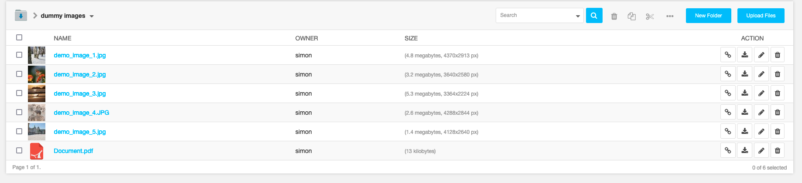

============
django-filer
============

A file management application for django that makes handling of files and images a breeze.

Filer picker widget: |file-picker-widget-screeshot|

.. |file-picker-widget-screeshot| image:: docs/_static/default_admin_file_widget.png

Documentation: http://django-filer.readthedocs.org/en/latest/index.html

Wiki: https://github.com/stefanfoulis/django-filer/wiki

Dependencies
------------

* `Django`_ >= 1.4
* `django-mptt`_ >=0.5.1
* `easy_thumbnails`_ >= 1.0
* `django-polymorphic`_ >= 0.2
* `Pillow`_ 2.3.0 (with JPEG and ZLIB support, `PIL`_ 1.1.7 is supported but not recommended)

``django.contrib.staticfiles`` is required.

**Django >= 1.6** is supported together with `django-polymorphic`_ >= 0.5.4

**Django >= 1.7** is supported together with `django-polymorphic`_ >= 0.5.6

Installation
------------

To get started using ``django-filer`` simply install it with
``pip``::

    $ pip install django-filer

Configuration
-------------

Add ``"filer"``, ``"mptt"`` and ``"easy_thumbnails"`` to your project's ``INSTALLED_APPS`` setting and run ``syncdb``
(and ``migrate`` if you're using South).

See the docs for advanced configuration:

* `subject location docs`_
* `permission docs`_ (experimental)
* `secure file downloads docs`_ (experimental)

Django 1.7
----------

Django 1.7 is supported together with the new migrations.
To avoid disrupting user experience the new migrations are installed in `filer.migrations_django`.
If you are going to deploy `filer` in a Django 1.7 project you are required to add the following configuration::

    MIGRATION_MODULES = {
            'filer': 'filer.migrations_django',
    }

South and Django migrations will be swapped in `filer` 1.0.

Testsuite
---------

The easiest way to run the testsuite is to checkout the code, make sure you have ``PIL`` installed, and run::

    python setup.py test

For serious testing ``tox`` is recommended. See documentation for details.

.. _Django: http://djangoproject.com
.. _django-polymorphic: https://github.com/chrisglass/django_polymorphic
.. _easy_thumbnails: https://github.com/SmileyChris/easy-thumbnails
.. _sorl.thumbnail: http://thumbnail.sorl.net/
.. _django-mptt: https://github.com/django-mptt/django-mptt/
.. _PIL: http://www.pythonware.com/products/pil/
.. _Pillow: http://pypi.python.org/pypi/Pillow/
.. _docs: http://django-filer.readthedocs.org/en/latest/index.html
.. _subject location docs: http://django-filer.readthedocs.org/en/latest/installation.html#subject-location-aware-cropping
.. _permission docs: http://django-filer.readthedocs.org/en/latest/permissions.html
.. _secure file downloads docs: http://django-filer.readthedocs.org/en/latest/secure_downloads.html
